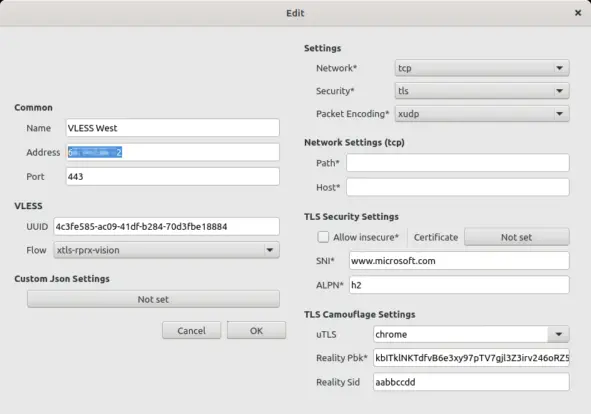

# Помощь по работе с Xray

Настройка XRay:

- [[#Установка сервера XRay]]
- [[#Настройка сервера XRay]]
- [[#Поиск сайта под который мы будем маскировать наш VPN]]
- [[#Маскировка XRay и задание параметров для него]]
  - [[#!!! На что стоит обратить внимание]]
  - [[#VLESS код профиля для авторизации]]

Использование XRay на клиентах пользователей:

- [[#Использование VPN на десктопе через NekoBox (Windows, Linux, и есть неофициальные билды под MacOS)]]

## Установка сервера XRay

Устанавливаем и распаковываем сервер **Xray**:

```bash
wget https://github.com/XTLS/Xray-core/releases/download/v1.8.1/Xray-linux-64.zip
mkdir /opt/xray
unzip ./Xray-linux-64.zip -d /opt/xray
chmod +x /opt/xray/xray
```

Создаем файл с настройками **Xray**:

```bash
nano /usr/lib/systemd/system/xray.service
```

Вставляем следующие настройки:

```ini
[Unit]
Description=Xray Service
Documentation=https://github.com/xtls
After=network.target nss-lookup.target

[Service]
User=nobody
CapabilityBoundingSet=CAP_NET_ADMIN CAP_NET_BIND_SERVICE
AmbientCapabilities=CAP_NET_ADMIN CAP_NET_BIND_SERVICE
NoNewPrivileges=true
ExecStart=/opt/xray/xray run -config /opt/xray/config.json
Restart=on-failure
RestartPreventExitStatus=23
LimitNPROC=10000
LimitNOFILE=1000000

[Install]
WantedBy=multi-user.target
```

Запускаем сервис **Xray**

```bash
systemctl enable xray
```

## Настройка сервера XRay

Для настройки нам понадобится ряд параметров. Часть из них нам может сгенерировать сам **XRay**:

```bash
/opt/xray/xray uuid # Генерирует идентификатор пользователя для протокола аутентификации VLESS
/opt/xray/xray x25519 # Генерирует приватный и публичный ключи
```

> **Советую сохранить приватный и публичный ключ**

Еще один параметр, который нужен - short ID, он представляет собой просто шестнадцатиричное число (символы 0-9, a-g) длиной до 8 байт (16 символов) - можно набрать любую абракадабру типа "aabbccdd" или запустить:

```bash
openssl rand -hex 8
```

## Поиск сайта под который мы будем маскировать наш VPN

Устанавливаем на свой пк папку "RealiTLScanner" и переходим в нее через терминал:

```bash
cd RealiTLScanner/
```

Далее запускаем комманду:

```bash
./RealiTLScanner -addr IP_вашего_VPS
```

Сканер будет перебирать IP-адреса из той же подсети, что и ваш сервер, и пытаться к ним подключиться по TLS. Если он что-то найдет - вы это увидите. Пример (я сканирую рандомный IPшник):

```bash
89.116.243.206:443  TLS handshake failed: EOF
89.116.243.207:443  TLS handshake failed: EOF
89.116.243.208:443  ----- Found TLS v1.3 ALPN    CN=caprover.com,O=CapRover.com,L=Vancouver,ST=British Columbia,C=CA,1.2.840.113549.1.9.1=#0c11696e666f40636170726f7665722e636f6d
89.116.243.209:443  TLS handshake failed: EOF
89.116.243.210:443  ----- Found TLS v1.3 ALPN    CN=patentpath.io
89.116.243.211:443  ----- Found TLS v1.3 ALPN    CN=vps3.gecon.pl
89.116.243.212:443  TLS handshake failed: EOF
89.116.243.213:443  TLS handshake failed: EOF
89.116.243.214:443  TLS handshake failed: EOF
89.116.243.215:443  TLS handshake failed: read tcp 192.168.136.132:55142->89.116.243.215:443: i/o timeout
89.116.243.216:443  ----- Found TLS v1.3 ALPN    CN=localhost,OU=none,O=none,L=Sometown,ST=Someprovince,C=US,1.2.840.113549.1.9.1=#0c137765626d6173746572406c6f63616c686f7374
89.116.243.217:443  TLS handshake failed: EOF
89.116.243.218:443  TLS handshake failed: EOF
89.116.243.219:443  TLS handshake failed: EOF
89.116.243.220:443  TLS handshake failed: EOF
89.116.243.221:443  TLS handshake failed: EOF
89.116.243.222:443  ----- Found TLS v1.3 ALPN    
89.116.243.223:443  ----- Found TLS v1.3 ALPN    CN=milapanel.milahosting.com
89.116.243.224:443  ----- Found TLS v1.3 ALPN    CN=vps-us.workx.dev
89.116.243.225:443  ----- Found TLS v1.3 ALPN    CN=www.google.com
89.116.243.226:443  ----- Found TLS v1.3 ALPN    CN=www.bookifynow.com
89.116.243.227:443  ----- Found TLS v1.3 ALPN    CN=next.tasosvl.cc
89.116.243.228:443  TLS handshake failed: EOF
89.116.243.229:443  ----- Found TLS v1.3 ALPN    CN=alpaca-dreams.com
89.116.243.230:443  TLS handshake failed: EOF
```

Если сканер нашел какие-то домены - попробуйте сходить на них браузером - должен открыться соответствующий сайт без каких-либо ошибок сертификатов. Если не открывается, или лезут ошибки - такой домен нам не подходит, а если открывается и ошибок нет - можно попробовать маскироваться под него.

## Маскировка XRay и задание параметров для него

На нашем сервере переходим в папку `/opt/xray/` и создаем файл `config.json`.
Далее вставляем в него следующие настройки:

```json
{
  "log": {
    "loglevel": "info"
  },
  "routing": {
    "rules": [],
    "domainStrategy": "AsIs"
  },
  "inbounds": [
    // Лично я данную настройку для подключения через shadowsocks не использую,
    // вы же можете раскоментировать ее на свое усмотрение
    // {
    //   "port": 23,
    //   "tag": "ss",
    //   "protocol": "shadowsocks",
    //   "settings": {
    //     "method": "2022-blake3-aes-128-gcm",
    //     "password": "aaaaaaaaaaaaaaaabbbbbbbbbbbbbbbb",
    //     "network": "tcp,udp"
    //   }
    // },
    {
      "port": 443,
      "protocol": "vless",
      "tag": "vless_tls",
      "settings": {
        "clients": [
          {
            "id": "4c3fe585-ac09-41df-b284-70d3fbe18884",
            "email": "user1@myserver",
            "flow": "xtls-rprx-vision"
          }
        ],
        "decryption": "none"
      },
      "streamSettings": {
        "network": "tcp",
        "security": "reality",
        "realitySettings": {
            "show": false,
            "dest": "www.microsoft.com:443",
            "xver": 0,
            "serverNames": [
                "www.microsoft.com"
            ],
            "privateKey": "GOTPj_klK7_j_IvjxiCtyBL80RYotYSOdBBBSfFOMH4",
            "minClientVer": "",
            "maxClientVer": "",
            "maxTimeDiff": 0,
            "shortIds": [
                "aabbccdd"
            ]
        }
      },
      "sniffing": {
        "enabled": true,
        "destOverride": [
          "http",
          "tls"
        ]
      }
    }
  ],
  "outbounds": [
    {
      "protocol": "freedom",
      "tag": "direct"
    },
    {
      "protocol": "blackhole",
      "tag": "block"
    }
  ]
}
```

### !!! На что стоит обратить внимание

Замените сайт для маскировки сервера. Заместо `www.site-you-found.com` подставляете доменное имя сайта, которое вы наши ранее:

```json
...
"dest": "www.site-you-found.com:443",
"xver": 0,
"serverNames": [
    "www.site-you-found.com"
],
...
```

Замените значение поля `privateKey` и `shortID` в разделе `realitySettings` на то, что мы сгенерировали ранее:

```json
...
"realitySettings": {
    ...
    "privateKey": "GOTPj_klK7_j_IvjxiCtyBL80RYotYSOdBBBSfFOMH4",
    ...
    "shortIds": [
        "aabbccdd"
    ]
    ...
}
...
```

Замените значение поля `id` в разделе `clients` на то, которое вы генерировали ранее:

```json
...
"clients": [
    {
        "id": "4c3fe585-ac09-41df-b284-70d3fbe18884",
        "email": "user1@myserver",
        "flow": "xtls-rprx-vision"
    }
],
...
```

? так же вы можете создавать несколько профилей клиентов для использования. Это позволит вам легче усправлять пользователями:

```json
...
"clients": [
    {
        "id": "uuid-1",
        "email": "user1@myserver",
        "flow": "xtls-rprx-vision"
    },
    {
        "id": "uuid-2",
        "email": "user2@myserver",
        "flow": "xtls-rprx-vision"
    }
],
...
```

Перезапускаем еще раз xray:

```bash
systemctl restart xray
```

Проверяем что все нормально запустилось:

```bash
journalctl -u xray
```

Например, XRay может ругнуться что не удается распарсить JSON-файл, обычно это связано с лишними запятыми в конце {} блока, в этом случае он укажет, на какой строке ошибка. Исправляем ошибки, перезапускаем еще раз, и переходим к настройке клиентов.

### VLESS код профиля для авторизации

Код профиля для авторизации на клиентах vpn будет выглядеть следующим образом:

```plaintext
vless://
$UUID
@$VPS_IP:$XRAY_VLESS_PORT
?type=tcp
&security=reality
&pbk=$PUBLIC_KEY
&fp=chrome
&sni=$DISGUISE_SITE
&sid=$SHORT_ID
&spx=%2F
&flow=xtls-rprx-vision
#$PROFILE_NAME
```

Обозначение всех параметров указанных с префиксом `$`:

- `$UUID` - Идентификатор (`clients.id`) одного из пользователей которое вы указали в файле конфигурации;
- `$VPS_IP` - IP-адрес вашей машины.
- `$XRAY_VLESS_PORT` - порт для протокола VLESS из файла конфигурации (по стандарту `443`);
- `$PUBLIC_KEY` - значение публичного ключа которое вы генерировали вместе с приватным ключем;
- `$DISGUISE_SITE` - сайт который вы прописали для маскировки VPN в конфигурации;
- `$SHORT_ID` - ID которое вы генериовали и прописывали в файле конфигураций в поле `realitySettings.shortIds`;
- `$PROFILE_NAME` - Здесь вы указываете название профиля которое будет отображаться на клиенте. Можете указать любое;

На выходе вы должны получить вот такую строку (пример строки):

```plaintext
vless://4c3fe585-ac09-41df-b284-70d3fbe18884@255.255.255.255:443?type=tcp&security=reality&pbk=GOTPj_klK7_j_IvjxiCtyBL80RYotYSOdBBBS&fp=chrome&sni=www.site-you-found.com&sid=aabbccdd&spx=%2F&flow=xtls-rprx-vision#my_own_vpn
```

---

## Использование VPN на десктопе через NekoBox (Windows, Linux)

Скачиваем архив `nekobox.zip` (или вы можете скачать с [официального github](https://github.com/MatsuriDayo/nekoray/releases) разработчиков) и разархивируем его в любую удобную вам директорию.
Переходим в распакованную директорию **Nekobox**.
Идем в *Server -> New profile* и заполняем все вот так:


